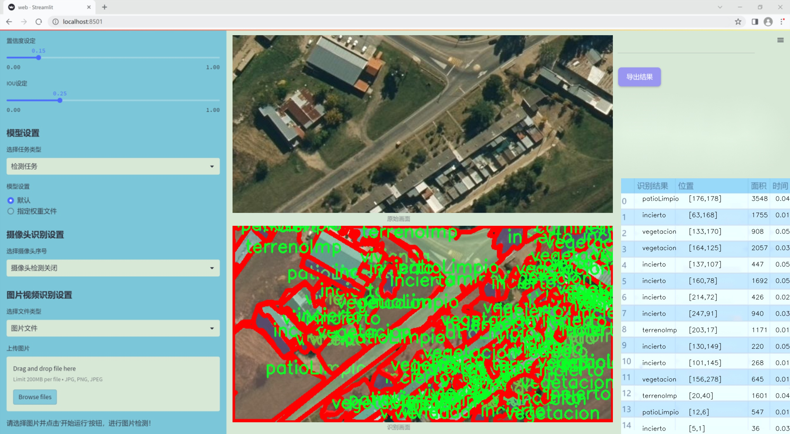
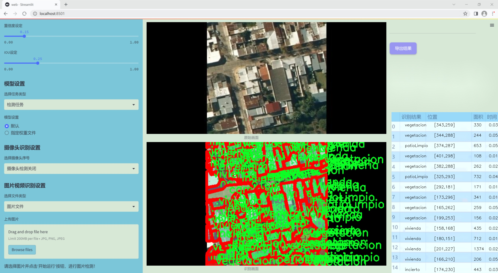
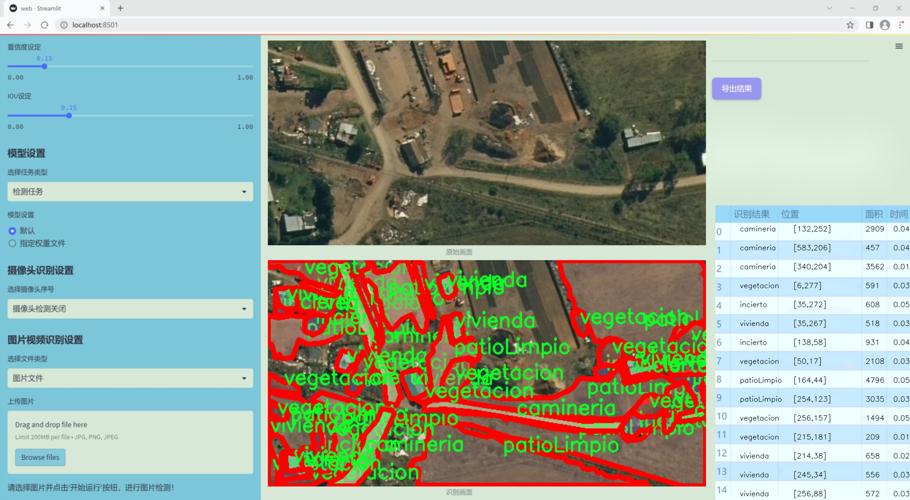
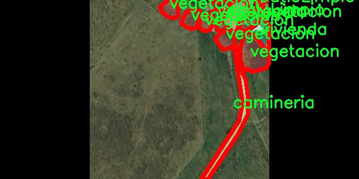
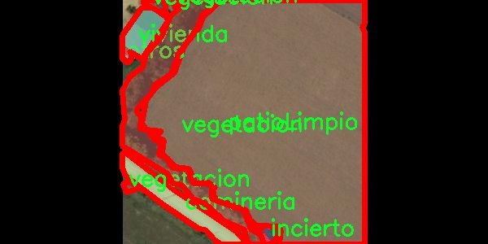
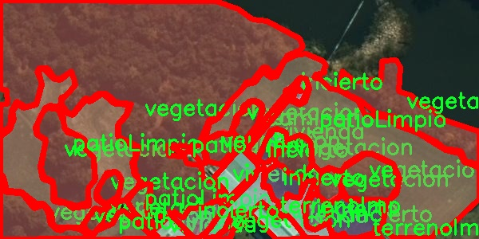
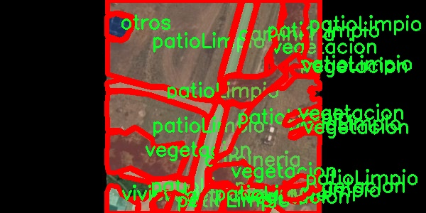
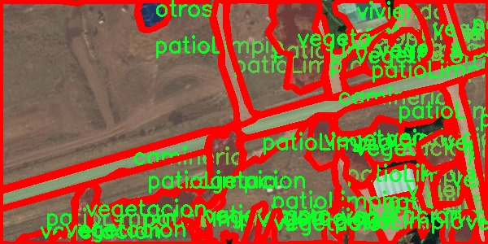

### 1.背景意义

研究背景与意义

随着遥感技术的快速发展，利用卫星和无人机获取的高分辨率图像在城市规划、环境监测和灾害管理等领域的应用愈发广泛。遥感场景分割作为计算机视觉中的一个重要任务，旨在将图像中的不同区域进行分类和标识，从而为后续的分析和决策提供基础数据。近年来，深度学习方法在图像分割领域取得了显著进展，尤其是基于YOLO（You Only Look Once）系列的模型，因其在实时检测和高效处理方面的优势而受到广泛关注。

本研究聚焦于基于改进YOLOv11的遥感场景分割系统，旨在提升对复杂场景的理解和分析能力。我们所使用的数据集包含七个类别，包括“camineria”、“incierto”、“otros”、“patioLimpio”、“terrenoImp”、“vegetacion”和“vivienda”，这些类别涵盖了城市和自然环境中的多种重要元素。通过对1025幅图像的精细标注和处理，我们期望能够训练出一个具有高精度和高鲁棒性的分割模型，以应对不同环境条件下的挑战。

在数据预处理和增强方面，我们采用了多种技术，如水平翻转、垂直翻转和90度旋转等，以增加数据的多样性，提升模型的泛化能力。这种方法不仅能够有效防止过拟合，还能使模型在面对不同场景时具备更强的适应性。

通过本研究，我们希望能够为遥感图像分析提供一种高效的解决方案，推动相关领域的研究进展，并为实际应用提供可靠的技术支持。随着遥感数据的不断增加和应用需求的多样化，基于深度学习的遥感场景分割系统将为未来的智能城市建设、生态环境保护和资源管理等方面提供重要的技术保障。

### 2.视频效果

[2.1 视频效果](https://www.bilibili.com/video/BV1dzUnY2Eag/)

### 3.图片效果







##### [项目涉及的源码数据来源链接](https://kdocs.cn/l/cszuIiCKVNis)**

注意：本项目提供训练的数据集和训练教程,由于版本持续更新,暂不提供权重文件（best.pt）,请按照6.训练教程进行训练后实现上图演示的效果。

### 4.数据集信息

##### 4.1 本项目数据集类别数＆类别名

nc: 7
names: ['camineria', 'incierto', 'otros', 'patioLimpio', 'terrenoImp', 'vegetacion', 'vivienda']


该项目为【图像分割】数据集，请在【训练教程和Web端加载模型教程（第三步）】这一步的时候按照【图像分割】部分的教程来训练

##### 4.2 本项目数据集信息介绍

本项目数据集信息介绍

本项目所使用的数据集旨在支持改进YOLOv11的遥感场景分割系统，具体聚焦于“SRMIGestionIngresos”主题。该数据集包含七个类别，分别为：camineria（道路）、incierto（不确定区域）、otros（其他）、patioLimpio（干净的院子）、terrenoImp（改良土地）、vegetacion（植被）和vivienda（住宅）。这些类别的选择反映了遥感图像中不同地物的多样性和复杂性，为训练深度学习模型提供了丰富的标注信息。

在数据集的构建过程中，图像的获取和标注遵循了严格的标准，以确保数据的质量和多样性。每个类别的样本均衡分布，使得模型在训练过程中能够学习到各类地物的特征，进而提高分割精度。通过对遥感图像的分析，数据集不仅包含了城市和乡村环境的多种场景，还涵盖了不同季节和天气条件下的图像，进一步增强了模型的泛化能力。

数据集的应用不仅限于基础的图像分割任务，还可扩展至城市规划、环境监测和资源管理等多个领域。通过改进YOLOv11模型，期望能够实现对遥感图像中各类地物的精准识别与分割，为相关研究提供有力的数据支持。总之，本项目的数据集在遥感场景分析中具有重要的应用价值，将为未来的研究和实践提供坚实的基础。











### 5.全套项目环境部署视频教程（零基础手把手教学）

[5.1 所需软件PyCharm和Anaconda安装教程（第一步）](https://www.bilibili.com/video/BV1BoC1YCEKi/?spm_id_from=333.999.0.0&vd_source=bc9aec86d164b67a7004b996143742dc)


[5.2 安装Python虚拟环境创建和依赖库安装视频教程（第二步）](https://www.bilibili.com/video/BV1ZoC1YCEBw?spm_id_from=333.788.videopod.sections&vd_source=bc9aec86d164b67a7004b996143742dc)

### 6.改进YOLOv11训练教程和Web_UI前端加载模型教程（零基础手把手教学）

[6.1 改进YOLOv11训练教程和Web_UI前端加载模型教程（第三步）](https://www.bilibili.com/video/BV1BoC1YCEhR?spm_id_from=333.788.videopod.sections&vd_source=bc9aec86d164b67a7004b996143742dc)


按照上面的训练视频教程链接加载项目提供的数据集，运行train.py即可开始训练



     Epoch   gpu_mem       box       obj       cls    labels  img_size
     1/200     20.8G   0.01576   0.01955  0.007536        22      1280: 100%|██████████| 849/849 [14:42<00:00,  1.04s/it]
               Class     Images     Labels          P          R     mAP@.5 mAP@.5:.95: 100%|██████████| 213/213 [01:14<00:00,  2.87it/s]
                 all       3395      17314      0.994      0.957      0.0957      0.0843

     Epoch   gpu_mem       box       obj       cls    labels  img_size
     2/200     20.8G   0.01578   0.01923  0.007006        22      1280: 100%|██████████| 849/849 [14:44<00:00,  1.04s/it]
               Class     Images     Labels          P          R     mAP@.5 mAP@.5:.95: 100%|██████████| 213/213 [01:12<00:00,  2.95it/s]
                 all       3395      17314      0.996      0.956      0.0957      0.0845

     Epoch   gpu_mem       box       obj       cls    labels  img_size
     3/200     20.8G   0.01561    0.0191  0.006895        27      1280: 100%|██████████| 849/849 [10:56<00:00,  1.29it/s]
               Class     Images     Labels          P          R     mAP@.5 mAP@.5:.95: 100%|███████   | 187/213 [00:52<00:00,  4.04it/s]
                 all       3395      17314      0.996      0.957      0.0957      0.0845


###### [项目数据集下载链接](https://kdocs.cn/l/cszuIiCKVNis)

### 7.原始YOLOv11算法讲解


##### YOLO11介绍

Ultralytics YOLO11是一款尖端的、最先进的模型，它在之前YOLO版本成功的基础上进行了构建，并引入了新功能和改进，以进一步提升性能和灵活性。
**YOLO11设计快速、准确且易于使用，使其成为各种物体检测和跟踪、实例分割、图像分类以及姿态估计任务的绝佳选择。**


**结构图如下：**


##### **C3k2**

**C3k2，结构图如下**


**C3k2，继承自类`C2f，其中通过c3k设置False或者Ture来决定选择使用C3k还是`**Bottleneck


**实现代码** **ultralytics/nn/modules/block.py**

##### C2PSA介绍

**借鉴V10 PSA结构，实现了C2PSA和C2fPSA，最终选择了基于C2的C2PSA（可能涨点更好？）**


**实现代码** **ultralytics/nn/modules/block.py**

##### Detect介绍

**分类检测头引入了DWConv（更加轻量级，为后续二次创新提供了改进点），结构图如下（和V8的区别）：**


### 8.200+种全套改进YOLOV11创新点原理讲解

#### 8.1 200+种全套改进YOLOV11创新点原理讲解大全

由于篇幅限制，每个创新点的具体原理讲解就不全部展开，具体见下列网址中的改进模块对应项目的技术原理博客网址【Blog】（创新点均为模块化搭建，原理适配YOLOv5~YOLOv11等各种版本）

[改进模块技术原理博客【Blog】网址链接](https://gitee.com/qunmasj/good)


#### 8.2 精选部分改进YOLOV11创新点原理讲解

###### 这里节选部分改进创新点展开原理讲解(完整的改进原理见上图和[改进模块技术原理博客链接](https://gitee.com/qunmasj/good)【如果此小节的图加载失败可以通过CSDN或者Github搜索该博客的标题访问原始博客，原始博客图片显示正常】
### 全维动态卷积ODConv
鉴于上述讨论，我们的ODConv引入了一种多维注意机制，该机制具有并行策略，用于学习卷积核在核空间的所有四个维度上的不同注意。图提供了CondConv、DyConv和ODConv的示意性比较。

ODConv的公式：根据等式1中的符号，ODConv可定义为


 将注意力标量分配给整个卷积核。图2示出了将这四种类型的关注乘以n个卷积核的过程。原则上，这四种类型的关注是相互补充的，并且以位置、信道、滤波器和核的顺序将它们逐步乘以卷积核 
 ，使得卷积运算不同w.r.t.所有空间位置、所有输入信道、所有滤波器和输入x的所有核，提供捕获丰富上下文线索的性能保证。因此，ODConv可以显著增强CNN基本卷积运算的特征提取能力。此外，具有单个卷积核的ODConv可以与标准CondConv和DyConv竞争或优于它们，为最终模型引入的额外参数大大减少。提供了大量实验来验证这些优点。通过比较等式1和等式2，我们可以清楚地看到，ODConv是一种更广义的动态卷积。此外，当设置n=1且 所有分量均为1时，只关注滤波器方向 的ODConv将减少为：将基于输入特征的SE变量应用于卷积滤波器，然后进行卷积运算（注意原始SE（Hu等人，2018b）基于输出特征，并且用于重新校准输出特征本身）。这种SE变体是ODConv的特例。


图：将ODConv中的四种注意类型逐步乘以卷积核的示例。（a） 沿空间维度的逐位置乘法运算，（b）沿输入信道维度的逐信道乘法运算、（c）沿输出信道维度的按滤波器乘法运算，以及（d）沿卷积核空间的核维度的按核乘法运算。方法部分对符号进行了说明
实现：对于ODConv，一个关键问题是如何计算卷积核的四种关注度 。继CondConv和DyConv之后，我们还使用SE型注意力模块（Hu等人，2018b），但将多个头部作为来计算它们，其结构如图所示。具体而言，首先通过逐通道全局平均池（GAP）运算将输入压缩到具有长度的特征向量中。随后，存在完全连接（FC）层和四个头部分支。ReLU（Krizhevsky等人，2012）位于FC层之后。FC层将压缩特征向量映射到具有缩减比的低维空间（根据消融实验，我们在所有主要实验中设置 ，避免了高模型复杂度）。对于四个头部分支，每个分支都有一个输出大小如图。

### 引入ODConv的改进YOLO
参考这篇博客涵盖了引入ODConv的改进YOLOv11系统的内容，ODConv采用多维注意机制，在卷积核空间的四个维度上学习不同的注意。结合了CondConv和DyConv的优势，ODConv通过图示的四种注意类型逐步与卷积核相乘，以捕获丰富的上下文线索，提升特征提取能力。

#### ODConv结构与方法
ODConv的公式和图示展示了其关注力分配给卷积核的方式，其中四种类型的关注以位置、信道、滤波器和核的顺序逐步与卷积核相乘。这种结构保证了卷积运算不同于标准的Conv操作，能够捕获更多上下文信息，从而增强了CNN的特征提取能力。另外，单个卷积核的ODConv在性能上能够与CondConv和DyConv相竞争，并且引入的额外参数大幅减少。

ODConv的特殊之处在于其广义的动态卷积性质，同时在特定条件下（n=1且所有分量为1），它可以退化为一种特例，即只关注滤波器方向，这类似于基于输入特征的SE变体，但不同于原始SE，它基于输出特征。

#### ODConv的实现
关键问题在于如何计算卷积核的四种关注度。ODConv采用了SE型注意力模块，结合了多个头部来计算这些关注度。具体实现上，通过逐通道全局平均池运算和完全连接层，将输入压缩为特征向量，随后使用四个头部分支来计算四种不同类型的关注。这样的结构能在保持模型复杂度可控的情况下，提升了特征的表征能力。

ODConv的引入为YOLOv11带来了显著的性能提升，并且通过大量实验证明了其在特征提取方面的优越性。其结合了多维注意机制和卷积操作，为目标检测和分拣系统的提升带来了新的思路和性能突破。


### 9.系统功能展示

图9.1.系统支持检测结果表格显示

  图9.2.系统支持置信度和IOU阈值手动调节

  图9.3.系统支持自定义加载权重文件best.pt(需要你通过步骤5中训练获得)

  图9.4.系统支持摄像头实时识别

  图9.5.系统支持图片识别

  图9.6.系统支持视频识别

  图9.7.系统支持识别结果文件自动保存

  图9.8.系统支持Excel导出检测结果数据


### 10. YOLOv11核心改进源码讲解

#### 10.1 fadc.py

以下是对代码中最核心部分的分析和详细注释。主要保留了`OmniAttention`、`FrequencySelection`和`AdaptiveDilatedConv`类的实现，这些部分是整个模型的关键。

```python
import torch
import torch.nn as nn
import torch.nn.functional as F

class OmniAttention(nn.Module):
    def __init__(self, in_planes, out_planes, kernel_size, groups=1, reduction=0.0625, kernel_num=4, min_channel=16):
        super(OmniAttention, self).__init__()
        # 计算注意力通道数
        attention_channel = max(int(in_planes * reduction), min_channel)
        self.kernel_size = kernel_size
        self.kernel_num = kernel_num
        self.temperature = 1.0  # 温度参数，用于调整注意力值的平滑程度

        # 定义网络结构
        self.avgpool = nn.AdaptiveAvgPool2d(1)  # 自适应平均池化
        self.fc = nn.Conv2d(in_planes, attention_channel, 1, bias=False)  # 线性变换
        self.bn = nn.BatchNorm2d(attention_channel)  # 批归一化
        self.relu = nn.ReLU(inplace=True)  # ReLU激活函数

        # 通道注意力
        self.channel_fc = nn.Conv2d(attention_channel, in_planes, 1, bias=True)
        self.func_channel = self.get_channel_attention

        # 过滤器注意力
        if in_planes == groups and in_planes == out_planes:  # 深度可分离卷积
            self.func_filter = self.skip
        else:
            self.filter_fc = nn.Conv2d(attention_channel, out_planes, 1, bias=True)
            self.func_filter = self.get_filter_attention

        # 空间注意力
        if kernel_size == 1:  # 点卷积
            self.func_spatial = self.skip
        else:
            self.spatial_fc = nn.Conv2d(attention_channel, kernel_size * kernel_size, 1, bias=True)
            self.func_spatial = self.get_spatial_attention

        # 核心注意力
        if kernel_num == 1:
            self.func_kernel = self.skip
        else:
            self.kernel_fc = nn.Conv2d(attention_channel, kernel_num, 1, bias=True)
            self.func_kernel = self.get_kernel_attention

        self._initialize_weights()  # 初始化权重

    def _initialize_weights(self):
        # 权重初始化
        for m in self.modules():
            if isinstance(m, nn.Conv2d):
                nn.init.kaiming_normal_(m.weight, mode='fan_out', nonlinearity='relu')
                if m.bias is not None:
                    nn.init.constant_(m.bias, 0)
            if isinstance(m, nn.BatchNorm2d):
                nn.init.constant_(m.weight, 1)
                nn.init.constant_(m.bias, 0)

    @staticmethod
    def skip(_):
        return 1.0  # 跳过操作，返回1

    def get_channel_attention(self, x):
        # 计算通道注意力
        channel_attention = torch.sigmoid(self.channel_fc(x).view(x.size(0), -1, 1, 1) / self.temperature)
        return channel_attention

    def get_filter_attention(self, x):
        # 计算过滤器注意力
        filter_attention = torch.sigmoid(self.filter_fc(x).view(x.size(0), -1, 1, 1) / self.temperature)
        return filter_attention

    def get_spatial_attention(self, x):
        # 计算空间注意力
        spatial_attention = self.spatial_fc(x).view(x.size(0), 1, 1, 1, self.kernel_size, self.kernel_size)
        spatial_attention = torch.sigmoid(spatial_attention / self.temperature)
        return spatial_attention

    def get_kernel_attention(self, x):
        # 计算核心注意力
        kernel_attention = self.kernel_fc(x).view(x.size(0), -1, 1, 1, 1, 1)
        kernel_attention = F.softmax(kernel_attention / self.temperature, dim=1)
        return kernel_attention

    def forward(self, x):
        # 前向传播
        x = self.avgpool(x)  # 自适应平均池化
        x = self.fc(x)  # 线性变换
        x = self.bn(x)  # 批归一化
        x = self.relu(x)  # ReLU激活
        return self.func_channel(x), self.func_filter(x), self.func_spatial(x), self.func_kernel(x)

class FrequencySelection(nn.Module):
    def __init__(self, in_channels, k_list=[2], lowfreq_att=True, fs_feat='feat', lp_type='freq', act='sigmoid', spatial='conv', spatial_group=1):
        super().__init__()
        self.k_list = k_list  # 频率列表
        self.lp_list = nn.ModuleList()  # 存储不同频率的模块
        self.freq_weight_conv_list = nn.ModuleList()  # 存储频率权重卷积层
        self.in_channels = in_channels  # 输入通道数
        self.lowfreq_att = lowfreq_att  # 是否使用低频注意力

        # 定义频率权重卷积层
        if spatial == 'conv':
            for i in range(len(k_list) + (1 if lowfreq_att else 0)):
                freq_weight_conv = nn.Conv2d(in_channels, spatial_group, kernel_size=3, padding=1, bias=True)
                self.freq_weight_conv_list.append(freq_weight_conv)

        # 定义低通滤波器
        if lp_type == 'avgpool':
            for k in k_list:
                self.lp_list.append(nn.AvgPool2d(kernel_size=k, stride=1, padding=0))

    def sp_act(self, freq_weight):
        # 应用激活函数
        if self.act == 'sigmoid':
            freq_weight = freq_weight.sigmoid() * 2
        elif self.act == 'softmax':
            freq_weight = freq_weight.softmax(dim=1) * freq_weight.shape[1]
        return freq_weight

    def forward(self, x):
        # 前向传播
        x_list = []
        pre_x = x
        b, _, h, w = x.shape
        for idx, avg in enumerate(self.lp_list):
            low_part = avg(x)  # 低频部分
            high_part = pre_x - low_part  # 高频部分
            pre_x = low_part
            freq_weight = self.freq_weight_conv_list[idx](x)  # 计算频率权重
            freq_weight = self.sp_act(freq_weight)  # 应用激活函数
            x_list.append(freq_weight * high_part)  # 加权高频部分
        return sum(x_list)  # 返回加权和

class AdaptiveDilatedConv(nn.Module):
    def __init__(self, in_channels, out_channels, kernel_size, stride=1, padding=0, dilation=1):
        super(AdaptiveDilatedConv, self).__init__()
        self.conv = nn.Conv2d(in_channels, out_channels, kernel_size, stride=stride, padding=padding, dilation=dilation)

    def forward(self, x):
        # 前向传播
        return self.conv(x)  # 直接应用卷积层
```

### 代码核心部分分析
1. **OmniAttention**:
   - 该类实现了多种注意力机制，包括通道注意力、过滤器注意力、空间注意力和核心注意力。通过自适应平均池化和全连接层，提取特征并计算不同类型的注意力。

2. **FrequencySelection**:
   - 该类实现了频率选择机制，使用不同的池化操作来提取低频和高频特征，并通过卷积层计算频率权重。

3. **AdaptiveDilatedConv**:
   - 该类封装了可调节的膨胀卷积，能够在卷积操作中动态调整膨胀率，适应不同的输入特征。

这些类共同构成了一个复杂的卷积神经网络架构，能够在不同的频率和空间尺度上进行特征提取和选择。

这个 `fadc.py` 文件实现了一些深度学习中的模块，主要包括自适应膨胀卷积（Adaptive Dilated Convolution）和频率选择（Frequency Selection）等功能。代码使用了 PyTorch 框架，下面是对代码的逐部分解释。

首先，文件导入了必要的库，包括 PyTorch 的核心库和一些功能模块。它还尝试从 `mmcv` 库中导入 `ModulatedDeformConv2d` 和 `modulated_deform_conv2d`，如果导入失败，则将其设置为普通的 `nn.Module`。

接下来，定义了一个名为 `OmniAttention` 的类，这是一个注意力机制模块。它的构造函数接受多个参数，包括输入和输出通道数、卷积核大小、组数、缩减比例等。该模块的主要功能是通过通道、过滤器、空间和内核注意力来调整输入特征图的权重。它使用了自适应平均池化、卷积、批归一化和 ReLU 激活函数来实现这一点。`forward` 方法计算并返回不同类型的注意力权重。

接着，定义了一个 `generate_laplacian_pyramid` 函数，用于生成拉普拉斯金字塔。该函数通过逐层下采样输入张量，计算每层的拉普拉斯差分，并将其存储在金字塔列表中。这个函数可以用于图像处理中的多尺度特征提取。

然后，定义了 `FrequencySelection` 类，该类用于选择特定频率的特征。它的构造函数中包含多个参数，用于配置频率选择的行为。该类通过不同的池化方式（如平均池化和拉普拉斯金字塔）来处理输入特征，并通过卷积操作生成频率权重。`forward` 方法根据不同的模式计算频率选择的输出。

接下来，定义了 `AdaptiveDilatedConv` 类，这是一个自适应膨胀卷积层的实现。它继承自 `ModulatedDeformConv2d`，并在构造函数中初始化了卷积层的偏移量和掩码。该类还实现了频率选择和注意力机制，以增强卷积操作的灵活性和表达能力。`forward` 方法中，首先计算偏移量和掩码，然后根据注意力权重和输入特征进行卷积操作。

最后，定义了 `AdaptiveDilatedDWConv` 类，这是一个深度可分离的自适应膨胀卷积层。它与 `AdaptiveDilatedConv` 类似，但在处理输入时将普通卷积和可变形卷积结合在一起。构造函数中同样包含了偏移量和掩码的初始化，并实现了频率选择和注意力机制。`forward` 方法中，分别处理普通卷积和可变形卷积的输出，并将它们合并。

整体来看，这个文件实现了一种灵活的卷积层，通过注意力机制和频率选择来增强特征提取能力，适用于图像处理和计算机视觉任务。

#### 10.2 fast_kan_conv.py

以下是经过简化和注释的核心代码部分：

```python
import torch
import torch.nn as nn

# 定义径向基函数（Radial Basis Function）类
class RadialBasisFunction(nn.Module):
    def __init__(self, grid_min: float = -2., grid_max: float = 2., num_grids: int = 8, denominator: float = None):
        super().__init__()
        # 在指定范围内生成均匀分布的网格点
        grid = torch.linspace(grid_min, grid_max, num_grids)
        self.grid = torch.nn.Parameter(grid, requires_grad=False)  # 将网格点设为不可训练的参数
        # 计算分母，默认为网格范围的均匀分布
        self.denominator = denominator or (grid_max - grid_min) / (num_grids - 1)

    def forward(self, x):
        # 计算径向基函数的输出
        return torch.exp(-((x[..., None] - self.grid) / self.denominator) ** 2)

# 定义FastKAN卷积层基类
class FastKANConvNDLayer(nn.Module):
    def __init__(self, conv_class, norm_class, input_dim, output_dim, kernel_size, groups=1, padding=0, stride=1, dilation=1, ndim: int = 2, grid_size=8, base_activation=nn.SiLU, grid_range=[-2, 2], dropout=0.0):
        super(FastKANConvNDLayer, self).__init__()
        # 初始化参数
        self.inputdim = input_dim
        self.outdim = output_dim
        self.kernel_size = kernel_size
        self.padding = padding
        self.stride = stride
        self.dilation = dilation
        self.groups = groups
        self.ndim = ndim
        self.grid_size = grid_size
        self.base_activation = base_activation()
        self.grid_range = grid_range

        # 验证参数的有效性
        if groups <= 0:
            raise ValueError('groups must be a positive integer')
        if input_dim % groups != 0:
            raise ValueError('input_dim must be divisible by groups')
        if output_dim % groups != 0:
            raise ValueError('output_dim must be divisible by groups')

        # 创建基础卷积层和样条卷积层
        self.base_conv = nn.ModuleList([conv_class(input_dim // groups, output_dim // groups, kernel_size, stride, padding, dilation, groups=1, bias=False) for _ in range(groups)])
        self.spline_conv = nn.ModuleList([conv_class(grid_size * input_dim // groups, output_dim // groups, kernel_size, stride, padding, dilation, groups=1, bias=False) for _ in range(groups)])
        self.layer_norm = nn.ModuleList([norm_class(output_dim // groups) for _ in range(groups)])

        # 初始化径向基函数
        self.rbf = RadialBasisFunction(grid_range[0], grid_range[1], grid_size)

        # 初始化dropout层
        self.dropout = nn.Dropout2d(p=dropout) if ndim == 2 else nn.Dropout3d(p=dropout) if ndim == 3 else nn.Dropout1d(p=dropout) if ndim == 1 else None

        # 使用Kaiming均匀分布初始化卷积层权重
        for conv_layer in self.base_conv:
            nn.init.kaiming_uniform_(conv_layer.weight, nonlinearity='linear')
        for conv_layer in self.spline_conv:
            nn.init.kaiming_uniform_(conv_layer.weight, nonlinearity='linear')

    def forward_fast_kan(self, x, group_index):
        # 处理输入数据并进行卷积操作
        base_output = self.base_conv[group_index](self.base_activation(x))  # 基础卷积
        if self.dropout is not None:
            x = self.dropout(x)  # 应用dropout
        spline_basis = self.rbf(self.layer_norm[group_index](x))  # 计算样条基
        spline_basis = spline_basis.moveaxis(-1, 2).flatten(1, 2)  # 调整维度
        spline_output = self.spline_conv[group_index](spline_basis)  # 样条卷积
        x = base_output + spline_output  # 合并输出

        return x

    def forward(self, x):
        # 将输入分割为多个组进行处理
        split_x = torch.split(x, self.inputdim // self.groups, dim=1)
        output = []
        for group_ind, _x in enumerate(split_x):
            y = self.forward_fast_kan(_x.clone(), group_ind)  # 处理每个组
            output.append(y.clone())
        y = torch.cat(output, dim=1)  # 合并所有组的输出
        return y
```

### 代码说明：
1. **RadialBasisFunction类**：实现了径向基函数的计算，主要用于在输入数据上生成平滑的基函数输出。
2. **FastKANConvNDLayer类**：这是一个通用的卷积层实现，支持多维卷积。它包含基础卷积和样条卷积，能够通过径向基函数对输入进行变换。
3. **forward_fast_kan方法**：处理输入数据，执行基础卷积和样条卷积，并将它们的输出合并。
4. **forward方法**：将输入数据分割成多个组，分别通过`forward_fast_kan`进行处理，并将结果合并为最终输出。

这个程序文件定义了一个名为 `fast_kan_conv.py` 的模块，主要用于实现一种高效的卷积层，称为 FastKAN 卷积层。该模块利用了径向基函数（Radial Basis Function, RBF）和标准卷积操作的组合，以增强神经网络在处理多维数据时的能力。

首先，程序中定义了一个 `RadialBasisFunction` 类，该类继承自 `nn.Module`。在初始化方法中，它创建了一个在指定范围内均匀分布的网格，并将其设置为不可训练的参数。该类的 `forward` 方法接收输入 `x`，并计算出基于网格的径向基函数值，输出一个经过高斯函数处理的结果，这对于后续的卷积操作至关重要。

接下来，定义了 `FastKANConvNDLayer` 类，这是 FastKAN 卷积层的核心实现。它的构造函数接受多个参数，包括输入和输出维度、卷积核大小、分组数、填充、步幅、扩张、维度数、网格大小、基础激活函数、网格范围和 dropout 比例等。构造函数中首先进行了一些参数的有效性检查，确保分组数为正整数且输入输出维度能够被分组数整除。

在该类中，定义了多个卷积层和归一化层，包括基础卷积层和样条卷积层。基础卷积层用于处理输入数据，而样条卷积层则利用径向基函数的输出进行进一步的卷积操作。此外，还可以根据需要添加 dropout 层，以防止过拟合。

`forward_fast_kan` 方法实现了 FastKAN 卷积的前向传播过程。它首先对输入数据应用基础激活函数，然后通过基础卷积层进行线性变换。接着，利用层归一化处理输入数据，并计算样条基函数的输出，最后将基础卷积和样条卷积的结果相加，形成最终的输出。

`forward` 方法则将输入数据按照分组进行拆分，并对每个分组调用 `forward_fast_kan` 方法，最后将所有分组的输出拼接在一起，形成最终的输出结果。

最后，程序还定义了三个特定维度的 FastKAN 卷积层类：`FastKANConv1DLayer`、`FastKANConv2DLayer` 和 `FastKANConv3DLayer`，分别用于一维、二维和三维卷积操作。这些类通过调用 `FastKANConvNDLayer` 的构造函数，并指定相应的卷积和归一化类，来实现不同维度的卷积操作。

整体来看，这个模块提供了一种灵活且高效的卷积层实现，适用于多种维度的数据处理，结合了传统卷积和基于径向基函数的卷积方法，能够在神经网络中发挥重要作用。

#### 10.3 rep_block.py

以下是代码中最核心的部分，并附上详细的中文注释：

```python
import torch
import torch.nn as nn
import torch.nn.functional as F

# 定义一个用于融合卷积核和批归一化的函数
def transI_fusebn(kernel, bn):
    # 从批归一化层中提取参数
    gamma = bn.weight  # 缩放因子
    std = (bn.running_var + bn.eps).sqrt()  # 标准差
    # 返回融合后的卷积核和偏置
    return kernel * ((gamma / std).reshape(-1, 1, 1, 1)), bn.bias - bn.running_mean * gamma / std

# 定义一个卷积和批归一化的组合层
def conv_bn(in_channels, out_channels, kernel_size, stride=1, padding=0, dilation=1, groups=1, padding_mode='zeros'):
    # 创建卷积层
    conv_layer = nn.Conv2d(in_channels=in_channels, out_channels=out_channels, kernel_size=kernel_size,
                           stride=stride, padding=padding, dilation=dilation, groups=groups,
                           bias=False, padding_mode=padding_mode)
    # 创建批归一化层
    bn_layer = nn.BatchNorm2d(num_features=out_channels, affine=True)
    # 将卷积层和批归一化层组合成一个序列
    se = nn.Sequential()
    se.add_module('conv', conv_layer)
    se.add_module('bn', bn_layer)
    return se

# 定义一个多分支块的类
class DiverseBranchBlock(nn.Module):
    def __init__(self, in_channels, out_channels, kernel_size, stride=1, padding=None, dilation=1, groups=1):
        super(DiverseBranchBlock, self).__init__()
        
        # 初始化参数
        self.kernel_size = kernel_size
        self.in_channels = in_channels
        self.out_channels = out_channels
        self.groups = groups
        
        # 计算填充
        if padding is None:
            padding = kernel_size // 2
        assert padding == kernel_size // 2

        # 定义主卷积和批归一化
        self.dbb_origin = conv_bn(in_channels=in_channels, out_channels=out_channels, kernel_size=kernel_size, 
                                  stride=stride, padding=padding, dilation=dilation, groups=groups)

        # 定义平均池化分支
        self.dbb_avg = nn.Sequential()
        self.dbb_avg.add_module('avg', nn.AvgPool2d(kernel_size=kernel_size, stride=stride, padding=padding))
        self.dbb_avg.add_module('avgbn', nn.BatchNorm2d(out_channels))

        # 定义1x1卷积分支
        self.dbb_1x1_kxk = nn.Sequential()
        self.dbb_1x1_kxk.add_module('conv1', nn.Conv2d(in_channels=in_channels, out_channels=out_channels, 
                                                        kernel_size=1, stride=stride, padding=0, groups=groups, bias=False))
        self.dbb_1x1_kxk.add_module('bn1', nn.BatchNorm2d(out_channels))

    def forward(self, inputs):
        # 前向传播
        out = self.dbb_origin(inputs)  # 主卷积输出
        out += self.dbb_avg(inputs)     # 加上平均池化输出
        out += self.dbb_1x1_kxk(inputs) # 加上1x1卷积输出
        return out  # 返回最终输出
```

### 代码核心部分解释：
1. **transI_fusebn**：这个函数用于将卷积层的权重与批归一化层的参数融合，返回融合后的卷积核和偏置。这在模型部署时非常重要，因为它可以减少计算量。

2. **conv_bn**：这个函数创建一个组合层，包括卷积层和批归一化层。它将卷积操作和批归一化操作结合在一起，以便在前向传播时可以一起计算。

3. **DiverseBranchBlock**：这是一个多分支块的实现，包含多个卷积分支（主卷积、平均池化、1x1卷积）。在前向传播中，它将这些分支的输出相加，形成最终的输出。这个设计使得网络能够学习到多种特征。

### 总结：
以上代码实现了一个灵活的卷积块，支持多种卷积分支的组合，通过融合卷积和批归一化来优化计算效率。这种结构在现代深度学习模型中非常常见，尤其是在需要高效特征提取的任务中。

这个程序文件 `rep_block.py` 定义了一些用于构建深度学习模型的模块，主要是多分支卷积块（Diverse Branch Block）。这些模块利用了 PyTorch 框架，包含了一些卷积操作、批归一化（Batch Normalization）以及其他相关的操作。以下是对文件中主要部分的说明。

首先，文件导入了必要的库，包括 PyTorch 的核心库和一些自定义的卷积模块。然后，定义了一些用于卷积和批归一化的转换函数，例如 `transI_fusebn` 用于将卷积层和批归一化层的权重和偏置合并，`transII_addbranch` 用于将多个卷积的输出合并等。

接下来，定义了几个类，分别是 `IdentityBasedConv1x1`、`BNAndPadLayer`、`DiverseBranchBlock`、`DiverseBranchBlockNOAct`、`DeepDiverseBranchBlock` 和 `WideDiverseBranchBlock`。这些类的构造函数中，定义了卷积层、批归一化层以及其他必要的层。

`IdentityBasedConv1x1` 类实现了一个 1x1 卷积层，带有身份映射的特性。它的前向传播方法中，将卷积权重与身份矩阵相加，以实现特定的卷积操作。

`BNAndPadLayer` 类则结合了批归一化和填充操作。它在前向传播中首先进行批归一化，然后根据需要进行填充，确保输出的尺寸符合要求。

`DiverseBranchBlock` 类是核心模块之一，它实现了多分支的卷积操作。根据输入的参数，它可以选择不同的卷积结构，包括标准卷积、1x1 卷积和平均池化等。它的前向传播方法会根据当前的状态（部署模式或训练模式）选择不同的路径进行计算。

`DiverseBranchBlockNOAct` 类是一个没有激活函数的多分支卷积块，类似于 `DiverseBranchBlock`，但省略了激活函数的应用。

`DeepDiverseBranchBlock` 和 `WideDiverseBranchBlock` 类是更复杂的多分支卷积块，分别实现了深度和宽度的多分支结构。它们在构造函数中定义了多个卷积层，并在前向传播中将它们的输出合并。

这些模块的设计考虑了在模型部署时的高效性，通过 `switch_to_deploy` 方法将训练时的结构转换为更简化的形式，以减少计算开销。

整体来看，这个文件提供了一系列灵活的卷积块，可以用于构建复杂的神经网络架构，特别是在需要多分支结构的情况下。通过合理的参数设置和模块组合，可以实现高效的特征提取和信息融合。

#### 10.4 CSwomTramsformer.py

以下是经过简化和注释的核心代码部分，主要保留了 CSWin Transformer 的结构和功能。

```python
import torch
import torch.nn as nn
import numpy as np

class Mlp(nn.Module):
    """多层感知机（MLP）模块"""
    def __init__(self, in_features, hidden_features=None, out_features=None, act_layer=nn.GELU, drop=0.):
        super().__init__()
        out_features = out_features or in_features  # 输出特征数
        hidden_features = hidden_features or in_features  # 隐藏层特征数
        self.fc1 = nn.Linear(in_features, hidden_features)  # 第一层线性变换
        self.act = act_layer()  # 激活函数
        self.fc2 = nn.Linear(hidden_features, out_features)  # 第二层线性变换
        self.drop = nn.Dropout(drop)  # Dropout层

    def forward(self, x):
        """前向传播"""
        x = self.fc1(x)
        x = self.act(x)
        x = self.drop(x)
        x = self.fc2(x)
        x = self.drop(x)
        return x

class CSWinBlock(nn.Module):
    """CSWin Transformer中的一个基本块"""
    def __init__(self, dim, num_heads, mlp_ratio=4., drop=0., attn_drop=0.):
        super().__init__()
        self.dim = dim  # 输入特征维度
        self.num_heads = num_heads  # 注意力头数
        self.mlp_ratio = mlp_ratio  # MLP的扩展比例
        self.qkv = nn.Linear(dim, dim * 3)  # 线性变换用于生成Q、K、V
        self.norm1 = nn.LayerNorm(dim)  # 第一层归一化
        self.attn = LePEAttention(dim, num_heads=num_heads, attn_drop=attn_drop)  # 注意力模块
        self.mlp = Mlp(in_features=dim, hidden_features=int(dim * mlp_ratio), out_features=dim)  # MLP模块
        self.norm2 = nn.LayerNorm(dim)  # 第二层归一化

    def forward(self, x):
        """前向传播"""
        img = self.norm1(x)  # 归一化
        qkv = self.qkv(img).reshape(x.shape[0], -1, 3, self.dim).permute(2, 0, 1, 3)  # 生成Q、K、V
        x = self.attn(qkv)  # 注意力计算
        x = x + self.mlp(self.norm2(x))  # 加上MLP的输出
        return x

class CSWinTransformer(nn.Module):
    """CSWin Transformer模型"""
    def __init__(self, img_size=640, in_chans=3, num_classes=1000, embed_dim=96, depth=[2, 2, 6, 2], num_heads=12):
        super().__init__()
        self.num_classes = num_classes
        self.embed_dim = embed_dim  # 嵌入维度

        # 初始卷积嵌入层
        self.stage1_conv_embed = nn.Sequential(
            nn.Conv2d(in_chans, embed_dim, 7, 4, 2),
            nn.LayerNorm(embed_dim)
        )

        # 构建多个CSWinBlock
        self.stage1 = nn.ModuleList([
            CSWinBlock(dim=embed_dim, num_heads=num_heads) for _ in range(depth[0])
        ])
        # 其他阶段的构建可以类推

    def forward(self, x):
        """前向传播"""
        x = self.stage1_conv_embed(x)  # 初始卷积嵌入
        for blk in self.stage1:
            x = blk(x)  # 通过每个CSWinBlock
        return x

# 创建模型的函数
def CSWin_tiny(pretrained=False, **kwargs):
    model = CSWinTransformer(embed_dim=64, depth=[1, 2, 21, 1], num_heads=2, **kwargs)
    return model

# 示例代码
if __name__ == '__main__':
    inputs = torch.randn((1, 3, 640, 640))  # 输入示例
    model = CSWin_tiny()  # 创建模型
    res = model(inputs)  # 前向传播
    print(res.size())  # 输出结果的尺寸
```

### 代码注释说明：
1. **Mlp 类**：实现了一个简单的多层感知机，包括两层线性变换和激活函数。
2. **CSWinBlock 类**：表示 CSWin Transformer 的基本构建块，包含注意力机制和 MLP。
3. **CSWinTransformer 类**：构建整个 CSWin Transformer 模型，包含初始卷积层和多个 CSWinBlock。
4. **CSWin_tiny 函数**：用于创建一个小型的 CSWin Transformer 模型实例。
5. **主程序**：提供了一个简单的示例，展示如何创建模型并进行前向传播。

这个程序文件实现了一个名为CSWin Transformer的视觉变换器模型，主要用于图像分类任务。该模型由多个模块组成，包括卷积嵌入、CSWin块、合并块等。程序首先导入了必要的库，包括PyTorch、timm和einops等。

文件中定义了多个类和函数。Mlp类实现了一个多层感知机（MLP），包含两个线性层和一个激活函数，支持dropout。LePEAttention类实现了局部增强的自注意力机制，能够处理输入的图像特征并计算注意力权重。CSWinBlock类则是模型的基本构建块，包含了注意力层和MLP层，并支持多分支的结构。Merge_Block类用于在不同阶段合并特征图。

CSWinTransformer类是整个模型的核心，初始化时接收多个参数，包括图像大小、补丁大小、输入通道数、类别数、嵌入维度、深度、分割大小、头数等。该类首先通过卷积层将输入图像嵌入到特征空间，然后依次通过多个CSWinBlock和Merge_Block进行特征提取。模型的前向传播过程通过forward_features方法实现，最终返回提取的特征。

此外，文件中还定义了一些辅助函数，例如img2windows和windows2img，用于将图像转换为窗口形式和将窗口转换回图像形式。还有用于加载预训练权重的函数和更新模型权重的函数。

最后，文件提供了几个函数（CSWin_tiny、CSWin_small、CSWin_base、CSWin_large）用于创建不同规模的CSWin Transformer模型，并可以选择加载预训练权重。在主程序中，创建了不同版本的模型并对随机生成的输入进行了前向传播，输出了每个模型的特征图尺寸。

整体来看，这个程序实现了一个复杂的视觉变换器模型，利用了现代深度学习中的多种技术，旨在提高图像处理的效果和效率。

### 11.完整训练+Web前端界面+200+种全套创新点源码、数据集获取


# [下载链接：https://mbd.pub/o/bread/Z5eUkp9v](https://mbd.pub/o/bread/Z5eUkp9v)